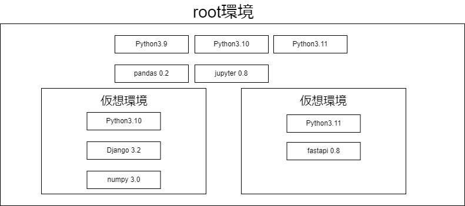

# Python開発の第一歩

## 前提

### 環境およびバージョン
- Windows 10、Windows 11
- Python 3.10 以降
- Visual Studio Code 1.71

### Pythonのセットアップ

#### Pythonのインストール
- [Pythonの公式サイト](https://www.python.org/)からバージョン3.XXインストーラーをダウンロードしてインストールする。
- インストール時に「Add Python 3.x to PATH」にチェックを入れる。
- `py -3.XX --version`でバージョンが表示されることを確認する。

#### WindowsにおけるPython
- Windows10以降、標準でPythonがインストールされている。
- ただしMicrosoft Storeを開くダミーコマンドであるためPythonプログラムの実行はできない

```
python --version
# バージョンが表示されない
```

### pythonの基本コマンド

#### pyコマンド
- pyコマンドはPythonのバージョンを切り替えるためのコマンドである。
- Windowsでは複数のpythonをインストール後にpyコマンドを用いて任意のバージョンを指定して実行することができる。
- 実行は`py -3.XX`で行う。

例）Python3.10を実行する場合
```
# バージョン確認
> py -3.10 --version
Python 3.10.6

# pipのバージョン確認
> py -3.10 -m pip --version
```

#### pipコマンド
- pipはPythonのパッケージ管理ツールである。
- pipコマンドを用いてpypi(Python Package Index)からサードパーティパッケージをインストールすることができる。

例）requestsパッケージをインストールする場合
```
> py -3.10 -m pip install requests
```

#### Pythonの仮想環境
- Python開発では多くの場合サードパーティライブラリを使用する。
- 不要なライブラリを実行環境へリリースしないために、仮想環境を作成することが推奨されている。
- Pythonの仮想環境を作成することで、プロジェクトごとにパッケージ、pythonランタイムのバージョンを管理することができる。


- root環境には複数のPythonバージョンがインストールされ `py` コマンドを経由してPythonが実行される
- 仮想環境ではPythonはバージョン指定して作成されるため、root環境とは異なるバージョンのPythonが実行される
- 仮想環境ごとに外部ライブラリをインストールすることができる

#### venvコマンド
- venvはPythonの仮想環境を作成するためのコマンドである。
- 仮想環境を作成することで、プロジェクトごとにパッケージ、pythonランタイムのバージョンを管理することができる。
- 仮想環境を作成すると、プロジェクトフォルダにvenvフォルダが作成される。

例）venvを作成する場合
```
> py -3.10 -m venv .venv
```
- .venvというディレクトリが作成される。

#### 仮想環境の有効化
- /path/to/venv/Scripts/activate.batを実行することで仮想環境を有効化することができる。

```
> .venv\Scripts\activate.bat
(.venv) >
```
- 仮想環境が有効化されると、プロンプトの先頭に(.venv)が表示される。

- VScodeのターミナルからも仮想環境を有効化することができる。
- Ctrl + Shift + Pでコマンドパレットを開き、Python: Select Interpreterを選択する。
- ★.venv\Scripts\python.exeを選択する。
- プロンプトの先頭に(.venv)が表示される。
- ターミナルがPowerShellの場合は、権限の問題で仮想環境が有効化されない場合がある。
  - ターミナルをcmdに変更するか、PowerShellの権限を変更する。
  - PowerShellの権限を変更する設定をsettings.jsonに記載する

```json:settings.json
{
    "terminal.integrated.env.windows": {
        "PSExecutionPolicyPreference": "RemoteSigned"
    }
}
```

#### requirements.txt
- requirements.txtはpipコマンドでインストールするパッケージを記載するファイルである。

```txt:requirements.txt
requests==2.26.0
django==3.2.8
```

- pipコマンドでrequirements.txtに記載されたパッケージを一括インストールすることができる。

```
(.venv)> pip install -r requirements.txt
```

- requirements.txtは環境ごとに作成すると便利である。

requirements.txt
```txt:requirements_dev.txt
requests==2.26.0
django==3.2.8
```

requirements_dev.txt
```txt:requirements_dev.txt
-r requirements.txt
black==21.10b0
django-sslserver==0.22
```

- requirements.txtを作成する場合は、pipコマンドでインストールしたパッケージを記載する。

```
pip freeze > requirements.txt
```